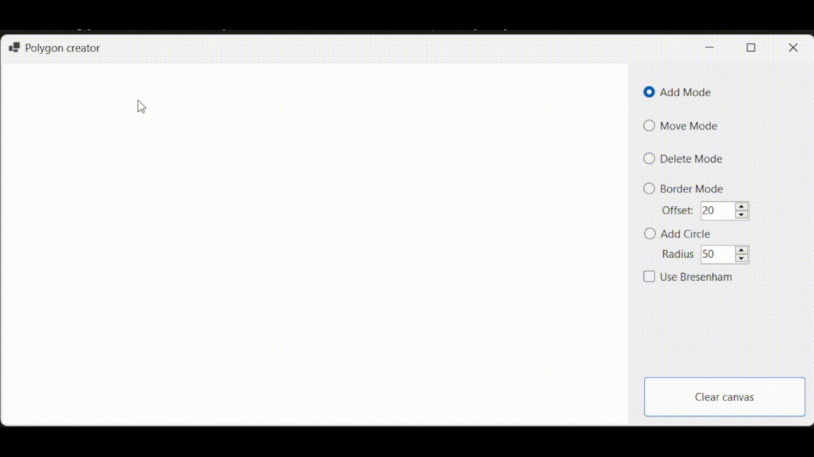

# PolygonEditor

**PolygonEditor** is a **.NET Windows Forms** application that allows users to create, edit, and manipulate polygons interactively. Users can add vertices, draw polygons, and enable **convex hull** generation. The application also provides advanced features such as locking edges horizontally or vertically for precise control and editing.

---

##  Tech Stack
- **Language**: C#
- **Framework**: .NET (Windows Forms)
- **Graphics Library**: GDI+ for rendering polygons and real-time updates.

---

## Presentation

